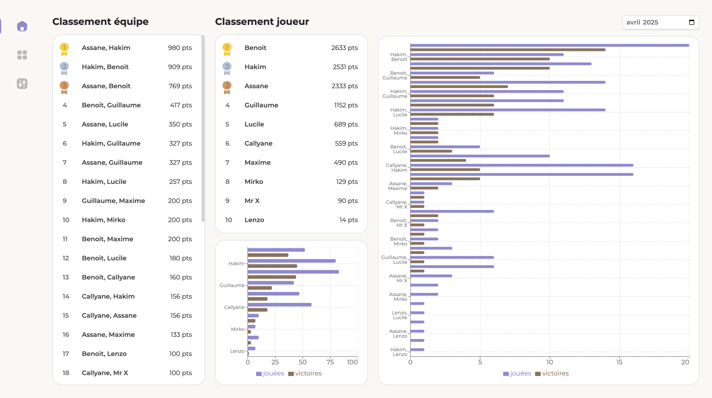
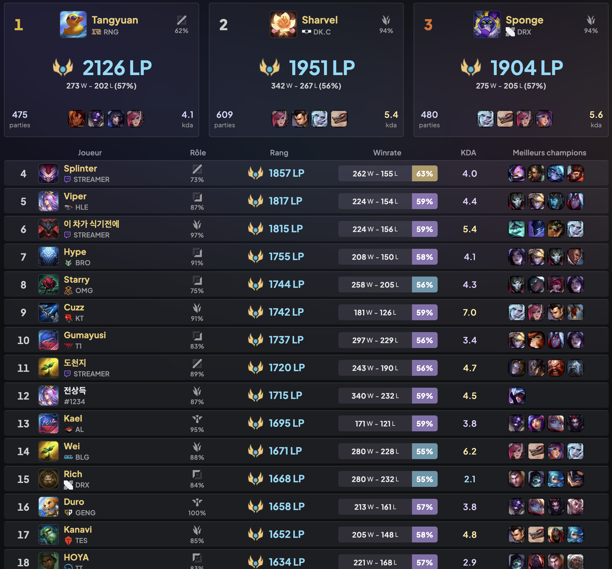
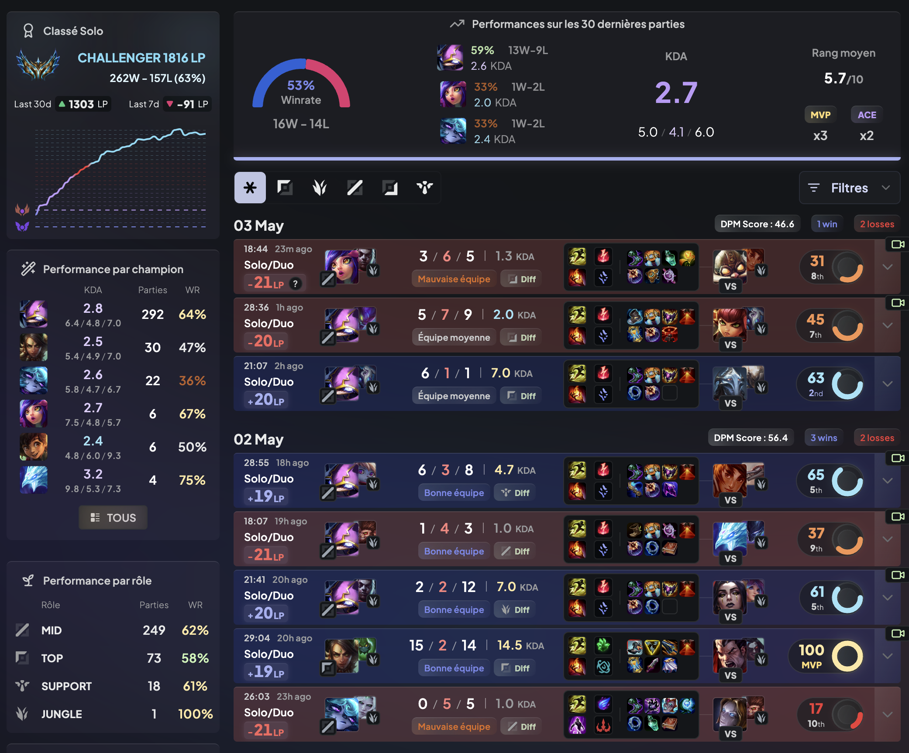
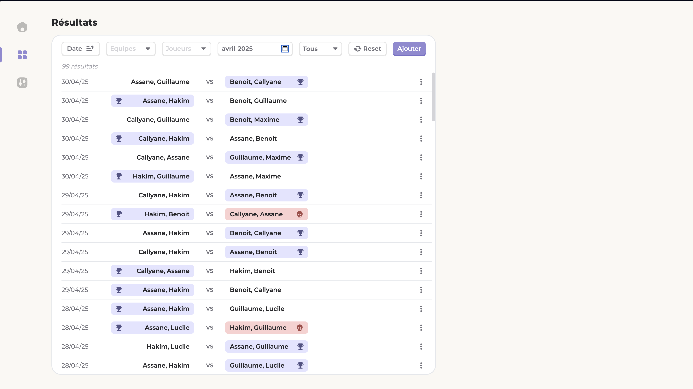
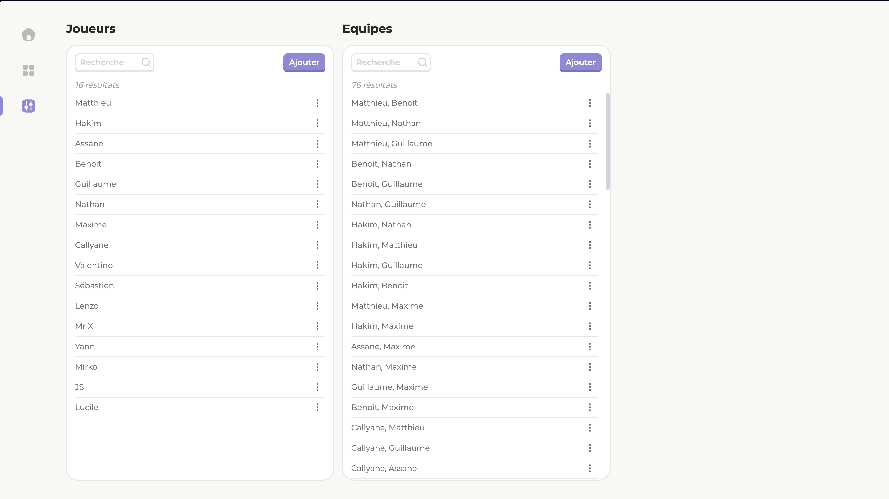

# Baby Foot ELO

## Description

Le baby-foot, également connu sous le nom de football de table, est un jeu de société où deux équipes de deux joueurs manipulent des figurines fixées sur des barres pour frapper une petite balle et tenter de marquer des buts dans le camp adverse. Au baby-foot, le terme "fanny" désigne une situation où une équipe termine une partie avec un score de zéro.

Baby Foot ELO est une application web qui permet à un groupe d'individus (collègues, amis, etc.) de suivre un championnat de baby-foot. Sa particularité réside dans l'utilisation d'un système de classement ELO hybride, où les joueurs d'une même équipe ne gagnent ou ne perdent pas le même nombre de points. Le calcul des points est personnalisé en fonction du classement individuel de chaque joueur et du classement de l'équipe adverse, offrant ainsi une évaluation plus juste des performances individuelles.

## Fonctionnalités

### Gestion des joueurs
- Enregistrement de nouveaux joueurs avec profil personnalisé
- Attribution d'un ELO initial (par défaut: 1000)
- Visualisation des statistiques individuelles
- Suivi de l'évolution de l'ELO au fil du temps

### Gestion des équipes
- Formation d'équipes de deux joueurs
- Déduction automatique des paires d'équipes possibles
- Calcul de l'ELO d'équipe (basé sur les ELO individuels)
- Classement dynamique des équipes

### Gestion des matchs
- Enregistrement des résultats de matchs (vainqueur, perdant, score)
- Support spécial pour les matchs "fanny" (avec bonus/malus)
- Calcul automatique des points ELO gagnés/perdus
- Historique complet des matchs joués

### Statistiques et visualisations
- Tableaux de classement des joueurs par ELO
- Tableaux de classement des équipes par ELO
- Graphiques d'évolution de l'ELO dans le temps
- Statistiques de compatibilité entre joueurs (taux de victoire par paire)

### Exports et data
- Export des résultats des matchs en JSON
- Historique complet consultable
- Données persistantes pour le suivi à long terme

## Architecture Technique

### Frontend
- Framework: **Next.js**
  - Interface réactive et moderne
  - Routage basé sur le système de fichiers
  - Thème sombre/clair avec dominante vert islamique
  - Composants réutilisables pour les tableaux et graphiques

### Backend
- Framework: **FastAPI**
  - API REST performante
  - Validation automatique des données
  - Documentation OpenAPI intégrée
  - Endpoints dédiés pour joueurs, équipes et matchs

### Base de données
- Technologie: **DuckDB**
  - Solution légère mais puissante
  - Optimisée pour les requêtes analytiques
  - Facilité de déploiement et maintenance

### Modèle de données
- **Joueurs**: id, nom, avatar, elo, date_création
- **Équipes**: id, joueur1_id, joueur2_id, elo, dernier_match
- **Matchs**: id, équipe_gagnante_id, équipe_perdante_id, score_gagnant, score_perdant, est_fanny, date
- **Historique_ELO**: id, joueur_id, match_id, ancien_elo, nouvel_elo, différence, date

## Pages et interfaces

### Page d'accueil




**Fonctionnalités:**
- Header avec navigation principale et switch thème clair/sombre
- Tableau de classement des joueurs par ELO
  - Position
  - Avatar et nom du joueur
  - Score ELO actuel
  - Évolution récente (7 derniers jours)
  - Nombre de matchs joués
- Tableau de classement des équipes par ELO
  - Position
  - Noms des joueurs de l'équipe
  - Score ELO de l'équipe
  - Ratio victoires/défaites
  - Nombre de matchs joués ensemble
- Filtres pour affiner les classements (période, nombre minimum de matchs)
- Accès rapide aux pages joueur via les entrées du tableau

### Page d'information d'un joueur



**Fonctionnalités:**
- Informations générales du joueur
  - Avatar et nom
  - ELO actuel
  - Date d'inscription
  - Nombre total de matchs
  - Ratio victoires/défaites
- Graphique d'évolution de l'ELO dans le temps
  - Visualisation claire de la progression
  - Points représentant les matchs joués
  - Informations détaillées au survol
  - Options de filtrage par période
- Historique des matchs récents
  - Date et équipes
  - Score
  - Points ELO gagnés/perdus
  - Indication des "fanny"
- Statistiques de compatibilité
  - Tableau des partenaires préférentiels
  - Taux de victoire avec chaque partenaire
  - Nombre de matchs joués ensemble
  - ELO moyen de l'équipe formée

### Page des résultats et enregistrement de match



**Fonctionnalités:**
- Formulaire d'enregistrement de match
  - Sélection des joueurs pour chaque équipe
  - Interface intuitive pour former les équipes
  - Saisie des scores
  - Option "fanny" à cocher
  - Calcul en temps réel des points ELO potentiels
- Historique complet des matchs
  - Filtrable par joueur, équipe ou période
  - Tri par date, importance du match (points ELO échangés)
  - Détails complets accessibles
- Bouton d'export en JSON
  - Possibilité de sélectionner les matchs à exporter
  - Format structuré pour utilisation externe
- Statistiques globales
  - Nombre total de matchs
  - Moyenne de points par match
  - Répartition des "fanny"

### Page de gestion des joueurs



**Fonctionnalités:**
- Formulaire d'ajout de nouveau joueur
  - Champ pour le nom
  - Upload d'avatar (optionnel)
  - ELO initial (modifiable, défaut 1000)
- Liste des joueurs existants
  - Fonctionnalités de recherche et tri
  - Option de modification/désactivation
  - Statistiques résumées
- Outil de génération d'équipes
  - Suggestion d'équipes équilibrées
  - Basé sur l'ELO ou d'autres critères
  - Utile pour organiser des matchs équitables
- Interface d'administration
  - Ajustements manuels d'ELO (avec journalisation)
  - Fusion de profils en cas de doublon
  - Réinitialisation de saison

## Système ELO hybride

### Principe fondamental
Le système ELO hybride utilisé par Baby Foot ELO repose sur le principe que les joueurs d'une même équipe peuvent avoir des contributions différentes à la victoire ou la défaite. Ainsi, ils ne reçoivent pas nécessairement le même nombre de points après un match.

### Calcul détaillé
1. **Score ELO d'équipe**
   - Calculé comme la moyenne des ELO individuels des deux joueurs
   - Exemple: Équipe A (Joueur A1: 1200, Joueur A2: 800) = ELO équipe 1000

2. **Probabilité de victoire d'équipe**
   - P(A) = 1 / (1 + 10^((ELO_B - ELO_A) / 400))
   - Où ELO_A et ELO_B sont les scores ELO des équipes

3. **Facteur K individuel**
   - Varie selon l'ELO du joueur:
     - ELO < 1200: K = 32 (joueurs débutants, progression rapide)
     - 1200 ≤ ELO < 1800: K = 24 (joueurs intermédiaires)
     - ELO ≥ 1800: K = 16 (joueurs expérimentés, stabilité)

4. **Ajustement d'ELO individuel**
   - Pour une victoire (S = 1):
     - Delta_ELO_i = K_i * (1 - P(A))
   - Pour une défaite (S = 0):
     - Delta_ELO_i = K_i * (0 - P(A))

5. **Facteurs spéciaux**
   - Match "fanny" (score 0): multiplicateur de 1.5x pour les perdants
   - Matchs déséquilibrés: facteur d'atténuation pour limiter les pertes/gains excessifs
   - Matchs entre nouveaux joueurs: facteur d'incertitude plus élevé

### Exemple concret
- **Équipe A**: Joueurs A1 (ELO 1200) et A2 (ELO 1000) → ELO équipe = 1100
- **Équipe B**: Joueurs B1 (ELO 900) et B2 (ELO 900) → ELO équipe = 900
- Probabilité de victoire pour A: P(A) = 0.71
- A bat B 10-5
- Points gagnés par A1: +7 ELO (K=24 * (1-0.71))
- Points gagnés par A2: +9 ELO (K=32 * (1-0.71))
- Points perdus par B1: -23 ELO (K=32 * (0-0.71))
- Points perdus par B2: -23 ELO (K=32 * (0-0.71))

## Implémentation et développement

### Structure du projet
```
baby_foot_elo/
├── frontend/               # Application Next.js
│   ├── pages/              # Routes de l'application
│   ├── components/         # Composants React réutilisables
│   ├── hooks/              # Hooks personnalisés
│   ├── styles/             # Styles CSS/Tailwind
│   ├── utils/              # Utilitaires et fonctions
│   └── public/             # Assets statiques
│
├── backend/                # API FastAPI
│   ├── app/                # Application principale
│   │   ├── api/            # Endpoints API
│   │   ├── core/           # Configuration
│   │   ├── models/         # Modèles de données
│   │   ├── services/       # Logique métier
│   │   └── utils/          # Utilitaires
│   ├── database/           # Scripts de base de données
│   └── tests/              # Tests unitaires et d'intégration
│
└── docs/                   # Documentation
    ├── capture/            # Captures d'écran et maquettes
    └── project.md          # Ce document
```

### API endpoints principaux
- `GET /api/players`: Liste des joueurs avec leur ELO
- `GET /api/players/{id}`: Détails d'un joueur spécifique
- `POST /api/players`: Création d'un nouveau joueur
- `GET /api/teams`: Liste des équipes possibles
- `GET /api/teams/ranking`: Classement des équipes
- `POST /api/matches`: Enregistrement d'un nouveau match
- `GET /api/matches`: Liste des matchs avec filtres
- `GET /api/stats/{player_id}`: Statistiques d'un joueur
- `GET /api/elo/history/{player_id}`: Historique ELO d'un joueur
- `POST /api/export`: Export des données en JSON

### Considérations d'interface utilisateur
- Interface responsive pour utilisation sur mobile et desktop
- Système de thèmes clair/sombre avec préférence utilisateur sauvegardée
- Animations subtiles pour les mises à jour d'ELO
- Couleur dominante: vert islamique (#009432)
- Icônes et visuels en rapport avec le baby-foot
- Tableaux triables et filtrables
- Graphiques interactifs avec informations au survol

### Prérequis de développement
- Node.js v16+ pour le frontend
- Python 3.9+ pour le backend
- Gestionnaires de paquets:
  - npm pour le frontend
  - Poetry pour le backend
- Environnement de développement:
  - VSCode avec extensions recommandées
  - ESLint/Prettier pour le frontend
  - Black/isort pour le backend

### Déploiement
- **Développement local**: 
  - Frontend: `npm run dev` (port 3000)
  - Backend: `uvicorn app.main:app --reload` (port 8000)
- **Production**: 
  - Options de déploiement flexibles selon le contexte d'utilisation
  - Configuration minimale requise très légère
  - Sauvegarde régulière des données recommandée
