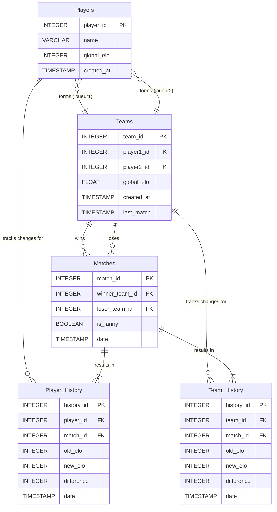

# Baby Foot ELO

## Description

Le baby-foot, également connu sous le nom de football de table, est un jeu de société où deux équipes de deux joueurs manipulent des figurines fixées sur des barres pour frapper une petite balle et tenter de marquer des buts dans le camp adverse. Au baby-foot, le terme "fanny" désigne une situation où une équipe termine une partie avec un score de zéro.

Baby Foot ELO est une application web qui permet à un groupe d'individus (collègues, amis, etc.) de suivre un championnat de baby-foot. Sa particularité réside dans l'utilisation d'un système de classement ELO hybride, où les joueurs d'une même équipe ne gagnent ou ne perdent pas le même nombre de points. Le calcul des points est personnalisé en fonction du classement individuel de chaque joueur et du classement de l'équipe adverse, offrant ainsi une évaluation plus juste des performances individuelles.

## Fonctionnalités

### Gestion des joueurs

- Enregistrement de nouveaux joueurs avec profil personnalisé
- Attribution d'un ELO initial (par défaut: 1000)
- Visualisation des statistiques individuelles
- Suivi de l'évolution de l'ELO au fil du temps

### Gestion des équipes

- Formation d'équipes de deux joueurs
- Attribution d'un ELO initial (par défaut: 1000)
- Suivi de l'évolution de l'ELO au fil du temps
- Classement dynamique des équipes (basé sur l'ELO d'équipe calculé)

### Gestion des matchs

- Enregistrement des résultats de matchs (vainqueur, perdant)
- Support pour les matchs "fanny" (symbolique, sans impact sur l'ELO)
- Calcul automatique des points ELO gagnés/perdus
- Historique complet des matchs joués

### Statistiques et visualisations

- Tableaux de classement des joueurs par ELO
- Tableaux de classement des équipes par ELO
- Graphiques d'évolution de l'ELO dans le temps
- Statistiques de compatibilité entre joueurs (taux de victoire par paire)
- Filtrage des classements par période (année, mois)

### Exports et data

- Export des résultats des matchs en JSON
- Historique complet consultable
- Données persistantes pour le suivi à long terme

## Architecture Technique

### Frontend

- Framework: **Next.js**
  - Interface réactive et moderne
  - Routage basé sur le système de fichiers
  - Thème sombre/clair avec dominante vert islamique
  - Composants réutilisables pour les tableaux et graphiques

### Backend

- Framework: **FastAPI**
- Framework web Python moderne et performant pour construire des APIs.
- Validation automatique des données grâce à Pydantic.
- Documentation API interactive générée automatiquement (Swagger UI, ReDoc).
- Support asynchrone pour des opérations I/O non bloquantes.

### Base de Données

- Système: **DuckDB**
- Base de données analytique in-process.
- Stockage des données dans un fichier unique (`.duckdb`).
- Syntaxe SQL standard, facilitant les requêtes complexes.
- Adaptée pour des applications où la base de données peut être locale au serveur backend.

### Modèle de données

- **Players**:
  - `player_id` (INTEGER PRIMARY KEY)
  - `name` (VARCHAR)
  - `global_elo` (INTEGER) _(Note: ELO basé sur tous les matchs)_
  - `created_at` (TIMESTAMP)

- **Teams**:
  - `team_id` (INTEGER PRIMARY KEY)
  - `player1_id` (INTEGER REFERENCES Players)
  - `player2_id` (INTEGER REFERENCES Players)
  - `global_elo` (FLOAT) _(Note: ELO basé sur tous les matchs)_
  - `created_at` (TIMESTAMP)
  - `last_match` (TIMESTAMP)

- **Matches**:
  - `match_id` (INTEGER PRIMARY KEY)
  - `winner_team_id` (INTEGER REFERENCES Teams)
  - `loser_team_id` (INTEGER REFERENCES Teams)
  - `is_fanny` (BOOLEAN)
  - `date` (TIMESTAMP)

- **Player_History**:
  - `history_id` (INTEGER PRIMARY KEY)
  - `player_id` (INTEGER REFERENCES Players)
  - `match_id` (INTEGER REFERENCES Matches)
  - `old_elo` (INTEGER)
  - `new_elo` (INTEGER)
  - `difference` (INTEGER)
  - `date` (TIMESTAMP)

- **Team_History**:
  - `history_id` (INTEGER PRIMARY KEY)
  - `team_id` (INTEGER REFERENCES Teams)
  - `match_id` (INTEGER REFERENCES Matches)
  - `old_elo` (INTEGER)
  - `new_elo` (INTEGER)
  - `difference` (INTEGER)
  - `date` (TIMESTAMP)

#### Diagramme Entité-Relation (Conceptuel)



## Pages et interfaces

### Page d'accueil (Classement en temps réel)


**Fonctionnalités:**

- Header avec navigation principale et switch thème clair/sombre
- Deux vues de classement en temps réel :
  - Global (basé sur tous les matchs)
  - Mois en cours (basé uniquement sur les matchs du mois)
- Tableau de classement des joueurs
  - Position
  - Nom du joueur
  - Score ELO (global ou mensuel selon la vue)
  - Évolution sur les 7 derniers jours
  - Nombre total de matchs joués
- Tableau de classement des équipes
  - Position
  - Noms des joueurs de l'équipe
  - Score ELO de l'équipe (global ou mensuel selon la vue)
  - Ratio victoires/défaites
  - Nombre de matchs joués ensemble
- Filtres additionnels:
  - Nombre minimum de matchs joués
  - Options d'affichage personnalisées
- Accès rapide aux pages joueur via les entrées du tableau

### Page d'information d'un joueur


**Fonctionnalités:**

- Informations générales du joueur
  - Nom
  - ELO global actuel
  - ELO du mois en cours
  - Nombre total de matchs
  - Ratio victoires/défaites
- Graphiques d'évolution
  - ELO global dans le temps
  - ELO mensuel (variation du ELO global durant le mois)
  - Points représentant les matchs
  - Informations détaillées au survol
- Historique des matchs récents
  - Date et équipes
  - Score
  - Points ELO gagnés/perdus (global et mensuel)
  - Indication des "fanny"
- Statistiques de compatibilité
  - Tableau des partenaires préférentiels
  - Taux de victoire avec chaque partenaire
  - Nombre de matchs joués ensemble
  - ELO moyen de l'équipe formée

### Page des résultats et enregistrement de match


**Fonctionnalités:**

- Formulaire d'enregistrement de match
  - Sélection des joueurs pour chaque équipe
  - Interface intuitive pour former les équipes
  - Saisie du résultat du match
  - Option "fanny" à cocher
  - Calcul en temps réel des points ELO potentiels (via appel API au backend)
  - Date du match (défaut: actuelle)
- Historique complet des matchs
  - Filtrable par joueur, équipe ou période (année, mois)
  - Tri par date, importance du match (points ELO échangés)
  - Détails complets accessibles
- Bouton d'export en JSON (via endpoint API backend)
  - Possibilité de sélectionner les matchs à exporter
  - Format structuré pour utilisation externe
- Statistiques globales
  - Nombre total de matchs
  - Moyenne de points par match
  - Répartition des "fanny"
  - Statistiques par période (année, mois)

### Page de gestion des joueurs


**Fonctionnalités:**

- Formulaire d'ajout de nouveau joueur
  - Champ pour le nom
  - ELO initial (pas modifiable, défaut 1000)
- Liste des joueurs existants
  - Fonctionnalités de recherche et tri
  - Option de modification/désactivation
  - Statistiques résumées
- Interface d'administration
  - Réinitialisation de saison ???

## Système ELO hybride

### Principe fondamental

Le système ELO hybride utilisé par Baby Foot ELO repose sur le principe que les joueurs d'une même équipe peuvent avoir des contributions différentes à la victoire ou la défaite. Ainsi, ils ne reçoivent pas nécessairement le même nombre de points après un match.

### Calcul détaillé

1. **Score ELO d'équipe**
   - Calculé comme la moyenne des ELO individuels des deux joueurs
   - Exemple: Équipe A (Joueur A1: 1200, Joueur A2: 800) = ELO équipe 1000

2. **Probabilité de victoire d'équipe**
   - P(A) = 1 / (1 + 10^((ELO_B - ELO_A) / 400))
   - Où ELO_A et ELO_B sont les scores ELO des équipes

3. **Facteur K individuel**
   - Varie selon l'ELO du joueur:
     - ELO < 1200: K = 100 (joueurs débutants, progression rapide)
     - 1200 ≤ ELO < 1800: K = 50 (joueurs intermédiaires)
     - ELO ≥ 1800: K = 24 (joueurs expérimentés, stabilité)

4. **Ajustement d'ELO individuel**
   - Pour une victoire:
     - Delta_ELO_i = K_i \* (1 - P(équipe du joueur))
   - Pour une défaite:
     - Delta_ELO_i = K_i \* (0 - P(équipe du joueur))

### Exemple concret

- **Équipe A**: Joueurs A1 (ELO 1200) et A2 (ELO 1000) → ELO équipe = 1100
- **Équipe B**: Joueurs B1 (ELO 900) et B2 (ELO 900) → ELO équipe = 900
- Probabilité de victoire pour A: P(A) = 0.71, pour B: P(B) = 1 - P(A) = 0.29
- Facteurs K: A1: K=50, A2: K=100, B1: K=100, B2: K=100
- A bat B 10-5
- Points gagnés par A1: +14 ELO (K=50 \* (1-0.71))
- Points gagnés par A2: +29 ELO (K=100 \* (1-0.71))
- Points perdus par B1: -29 ELO (K=100 \* (0-0.29))
- Points perdus par B2: -29 ELO (K=100 \* (0-0.29))

> _Cette logique de calcul sera implémentée dans le backend FastAPI, probablement déclenchée lors de l'enregistrement d'un nouveau match via un endpoint API._

## Implémentation et développement

### Structure du projet

```markdown
baby_foot_elo/
├── frontend/ # Application Next.js
│ ├── pages/ # Routes de l'application
│ ├── components/ # Composants React réutilisables
│ ├── hooks/ # Hooks personnalisés
│ ├── styles/ # Styles CSS/Tailwind
│ ├── services/ # Fonctions pour appeler l'API backend
│ ├── utils/ # Utilitaires divers
│ └── public/ # Assets statiques
│
├── backend/ # Application FastAPI
│ ├── app/ # Code source de l'application
│ │ ├── main.py # Point d'entrée FastAPI
│ │ ├── routers/ # Fichiers de routes (endpoints API)
│ │ ├── models/ # Modèles Pydantic (validation de données)
│ │ ├── schemas/ # Schémas de base de données (si ORM utilisé)
│ │ ├── crud/ # Fonctions d'accès aux données (CRUD)
│ │ ├── core/ # Configuration, logique métier centrale
│ │ └── db/ # Gestion de la base de données DuckDB
│ ├── tests/ # Tests unitaires/intégration
│ └── .env # Variables d'environnement (ex: chemin DB)
│
├── data/ # Données persistantes
│ └── babyfoot_elo.duckdb # Fichier de base de données DuckDB
│
└── docs/ # Documentation
├── capture/ # Captures d'écran et maquettes
└── project.md # Ce document
```

### Interaction Frontend-Backend

L'interaction entre le frontend Next.js et le backend FastAPI se fera via des appels API RESTful:

- **Client HTTP dans Next.js:** Utilisation de `fetch` ou d'une librairie comme `axios` pour envoyer des requêtes aux endpoints définis dans FastAPI.
  - Exemple: `fetch('/api/v1/players')` pour lister les joueurs.
  - Exemple: `POST /api/v1/matches` avec les données du match pour enregistrer un résultat.
- **Endpoints FastAPI:** Le backend expose des endpoints pour chaque fonctionnalité (CRUD joueurs, équipes, matchs, calcul ELO, classements, etc.).
  - `/players`, `/matches`, `/teams`, `/periodic-rankings`, etc.
- **Authentification:** Une stratégie d'authentification devra être mise en place (ex: JWT tokens) si des fonctionnalités nécessitent une protection. FastAPI offre des outils pour cela.

### Considérations d'interface utilisateur

- Interface responsive pour utilisation sur mobile et desktop
- Système de thèmes clair/sombre avec préférence utilisateur sauvegardée
- Animations subtiles pour les mises à jour d'ELO
- Couleur dominante: vert islamique (#009432)
- Icônes et visuels en rapport avec le baby-foot
- Tableaux triables et filtrables
- Graphiques interactifs avec informations au survol

### Prérequis de développement

- **Frontend:**
  - Node.js v16+
  - npm (ou yarn/pnpm)
- **Backend:**
  - Python 3.8+
  - Poetry (pour la gestion des dépendances et de l'environnement virtuel)
  - FastAPI, Uvicorn (serveur ASGI), DuckDB Python package, et autres dépendances gérées via `pyproject.toml`.
- **Environnement de développement:**
  - VSCode avec extensions recommandées (ESLint, Prettier, Python, Pylance)
  - Outils de formatage/linting (Prettier pour JS/TS, Black/Flake8/Ruff pour Python)

### Déploiement

- **Développement local**:
  - Frontend: `npm run dev` (port 3000)
  - Backend: `uvicorn app.main:app --reload` (port 8000 par défaut)
- **Production**:
  - **Frontend (Next.js):** Déploiement sur Vercel, Netlify, ou autre hébergeur Node.js/statique.
  - **Backend (FastAPI):**
    - Déploiement sur des plateformes comme Docker (via conteneurisation), Heroku, Render, Fly.io, ou un serveur VPS.
    - Le fichier DuckDB (`babyfoot_elo.duckdb`) doit être accessible par l'instance backend déployée (ex: via un volume persistant si conteneurisé).
    - Utilisation d'un serveur ASGI plus robuste comme Gunicorn avec Uvicorn workers.
  - **Base de données (DuckDB):** Le fichier de base de données est géré avec l'application backend. Des stratégies de sauvegarde régulières du fichier `.duckdb` sont nécessaires.
