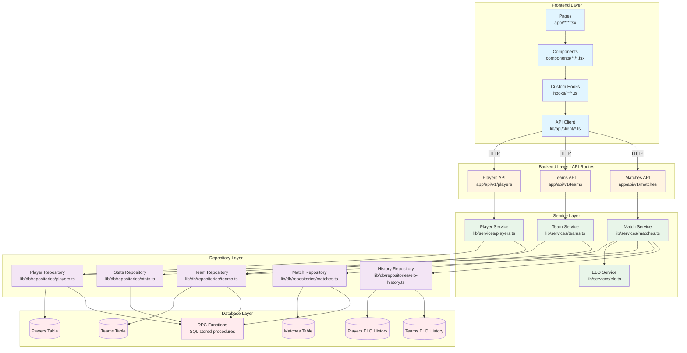
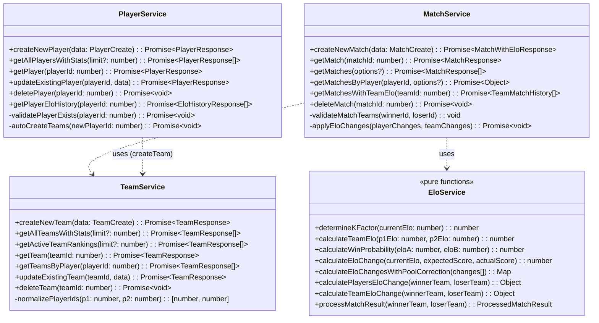
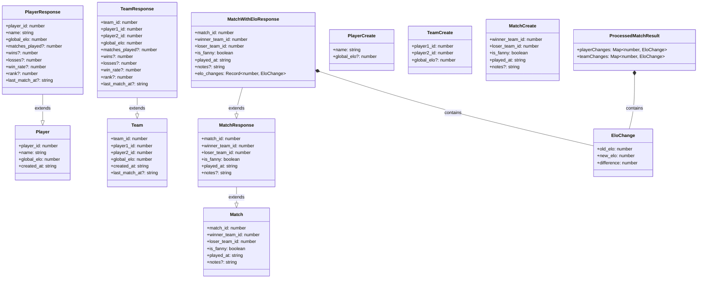
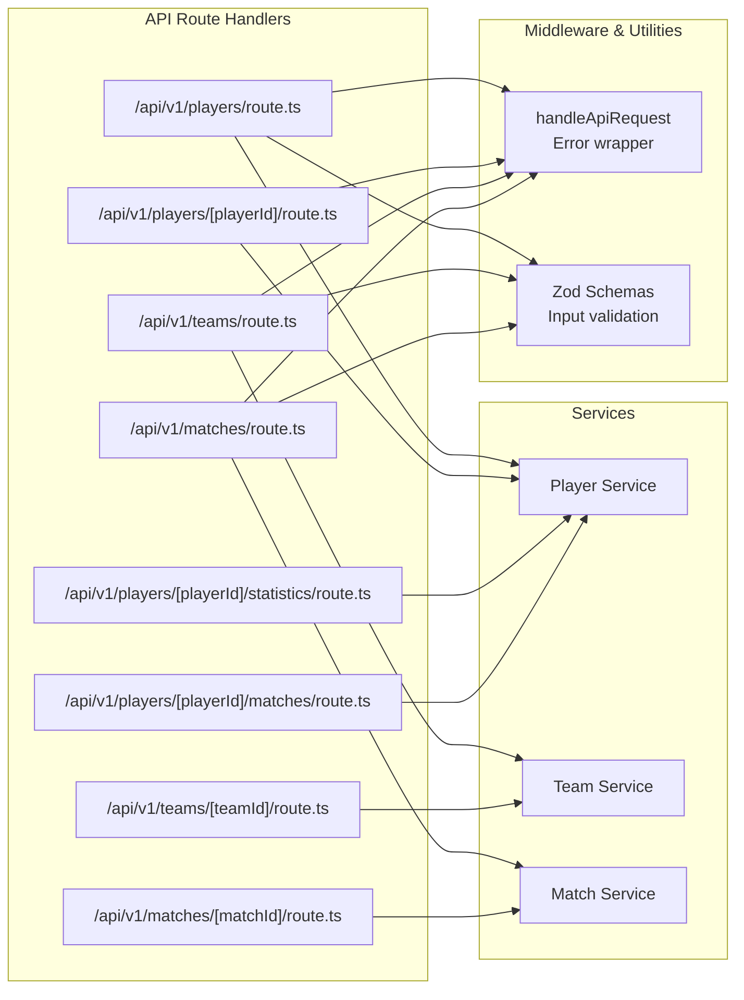
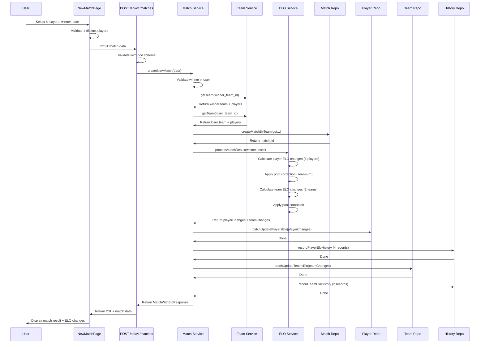
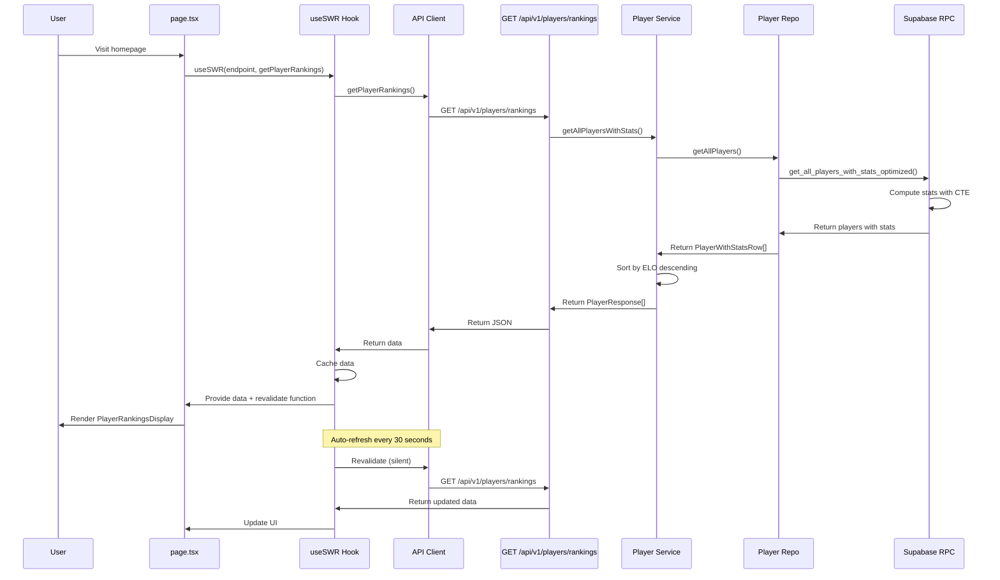
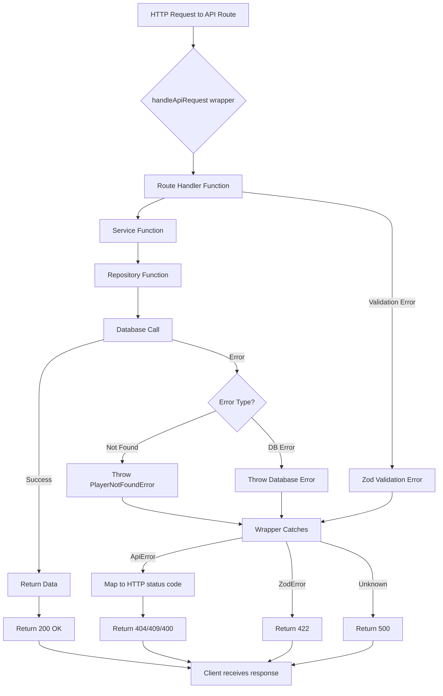
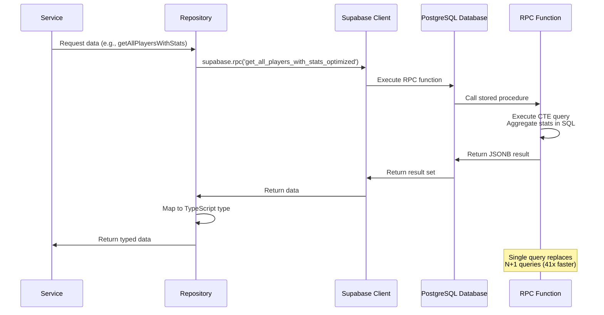

# Class Diagrams and Relationships

**Last Updated**: 2025-12-26
**Document Type**: Architecture Diagrams
**Target Audience**: Developers, Architects

---

## Overview

This document provides comprehensive class diagrams showing the relationships between all major components in the Baby Foot ELO system. The diagrams use Mermaid syntax for visualization.

---

## System-Wide Architecture Diagram



---

## Service Layer Class Diagram



---

## Repository Layer Class Diagram

```mermaid
classDiagram
    class PlayerRepository {
        +createPlayer(name: string, elo?: number): Promise~Player~
        +getPlayerById(playerId: number): Promise~Player~
        +getPlayerByName(name: string): Promise~Player | null~
        +getAllPlayers(): Promise~PlayerWithStatsRow[]~
        +updatePlayerElo(playerId, newElo): Promise~void~
        +batchUpdatePlayersElo(updates[]): Promise~void~
        +updatePlayer(playerId, updates): Promise~Player~
        +deletePlayerById(playerId): Promise~void~
        +recordPlayerEloHistory(...): Promise~void~
        +getPlayerEloHistory(playerId): Promise~PlayerEloHistoryRow[]~
    }

    class TeamRepository {
        +normalizePlayerIds(p1, p2): [number, number]
        +createTeamByPlayerIds(p1, p2, elo?): Promise~Team~
        +getTeamById(teamId: number): Promise~Team | null~
        +getTeamByPlayerIds(p1, p2): Promise~Team | null~
        +getAllTeams(): Promise~TeamWithStatsRow[]~
        +getTeamsByPlayerId(playerId): Promise~TeamWithStatsRow[]~
        +getActiveTeamsWithStats(min, days): Promise~TeamWithStatsRow[]~
        +updateTeamElo(teamId, newElo): Promise~void~
        +batchUpdateTeamsElo(updates[]): Promise~void~
        +deleteTeamById(teamId): Promise~void~
        +recordTeamEloHistory(...): Promise~void~
    }

    class MatchRepository {
        +createMatchByTeamIds(winner, loser, ...): Promise~number~
        +getMatchById(matchId: number): Promise~Match | null~
        +getAllMatches(options?): Promise~any[]~
        +getMatchesByTeamId(teamId): Promise~any[]~
        +getMatchesByPlayerId(playerId, limit?, offset?): Promise~Object~
        +deleteMatchById(matchId): Promise~void~
    }

    class StatsRepository {
        +getPlayerStats(playerId: number): Promise~PlayerStatsRow | null~
        +getTeamStats(teamId: number): Promise~TeamStatsRow | null~
    }

    class EloHistoryRepository {
        +getPlayerEloHistory(playerId): Promise~PlayerEloHistoryRow[]~
        +getTeamEloHistory(teamId): Promise~TeamEloHistoryRow[]~
    }

    class SupabaseClient {
        <<singleton>>
        +from(table: string): QueryBuilder
        +rpc(functionName: string, params?): Promise
    }

    %% All repositories use Supabase client
    PlayerRepository ..> SupabaseClient : uses
    TeamRepository ..> SupabaseClient : uses
    MatchRepository ..> SupabaseClient : uses
    StatsRepository ..> SupabaseClient : uses
    EloHistoryRepository ..> SupabaseClient : uses
```



---

## Domain Model (Database Entities)

```mermaid
erDiagram
    PLAYERS ||--o{ PLAYERS_ELO_HISTORY : "has history"
    PLAYERS ||--o{ TEAMS : "is in (as player1)"
    PLAYERS ||--o{ TEAMS : "is in (as player2)"
    TEAMS ||--o{ TEAMS_ELO_HISTORY : "has history"
    TEAMS ||--o{ MATCHES : "wins"
    TEAMS ||--o{ MATCHES : "loses"
    MATCHES ||--o{ PLAYERS_ELO_HISTORY : "causes"
    MATCHES ||--o{ TEAMS_ELO_HISTORY : "causes"

    PLAYERS {
        int player_id PK
        string name UNIQUE
        int global_elo
        timestamp created_at
    }

    TEAMS {
        int team_id PK
        int player1_id FK
        int player2_id FK
        int global_elo
        timestamp created_at
        timestamp last_match_at
    }

    MATCHES {
        int match_id PK
        int winner_team_id FK
        int loser_team_id FK
        boolean is_fanny
        timestamp played_at
        text notes
    }

    PLAYERS_ELO_HISTORY {
        int history_id PK
        int player_id FK
        int match_id FK
        int old_elo
        int new_elo
        int difference
        timestamp date
    }

    TEAMS_ELO_HISTORY {
        int history_id PK
        int team_id FK
        int match_id FK
        int old_elo
        int new_elo
        int difference
        timestamp date
    }
```

---

## Type System Class Diagram



---

## Frontend Component Hierarchy

```mermaid
graph TB
    subgraph "Pages (Next.js App Router)"
        HomePage[page.tsx<br/>Player Rankings]
        PlayersListPage[players/page.tsx<br/>Players List]
        PlayerDetailPage[players/[id]/page.tsx<br/>Player Detail]
        TeamsListPage[teams/page.tsx<br/>Teams List]
        TeamDetailPage[teams/[id]/page.tsx<br/>Team Detail]
        MatchesPage[matches/page.tsx<br/>Match History]
    end

    subgraph "Feature Components - Players"
        PlayerRankingsDisplay[PlayerRankingsDisplay]
        PlayerRegistrationForm[PlayerRegistrationForm]
        PlayerDetail[PlayerDetail]
        PlayerMatchesSection[PlayerMatchesSection]
    end

    subgraph "Feature Components - Teams"
        TeamRankingsDisplay[TeamRankingsDisplay]
        TeamDetail[TeamDetail]
        TeamMatchesSection[TeamMatchesSection]
    end

    subgraph "Feature Components - Matches"
        NewMatchDialog[NewMatchDialog]
        NewMatchPage[NewMatchPage]
        MatchHistoryUI[MatchHistoryUI]
    end

    subgraph "Common Components"
        RankingTable[RankingTable]
        EntityStatsCards[EntityStatsCards]
        EntityMatchesSection[EntityMatchesSection]
    end

    subgraph "UI Primitives (ShadCN)"
        Button[Button]
        Dialog[Dialog]
        Table[Table]
        Card[Card]
        Form[Form]
    end

    %% Page to Component connections
    HomePage --> PlayerRankingsDisplay
    PlayersListPage --> PlayerRankingsDisplay
    PlayersListPage --> PlayerRegistrationForm
    PlayerDetailPage --> PlayerDetail
    PlayerDetailPage --> PlayerMatchesSection
    TeamsListPage --> TeamRankingsDisplay
    TeamDetailPage --> TeamDetail
    TeamDetailPage --> TeamMatchesSection
    MatchesPage --> MatchHistoryUI
    MatchesPage --> NewMatchDialog

    %% Component composition
    PlayerRankingsDisplay --> RankingTable
    PlayerDetail --> EntityStatsCards
    PlayerMatchesSection --> EntityMatchesSection
    TeamRankingsDisplay --> RankingTable
    TeamDetail --> EntityStatsCards
    TeamMatchesSection --> EntityMatchesSection
    NewMatchDialog --> NewMatchPage

    %% Common to UI primitive
    RankingTable --> Table
    EntityStatsCards --> Card
    NewMatchPage --> Form
    NewMatchPage --> Button
    NewMatchDialog --> Dialog
```

---

## API Route Handler Structure



---

## Match Creation Sequence Diagram



---

## Data Flow: Player Rankings Display



---

## ELO Calculation Flow Diagram

```mermaid
flowchart TD
    Start[Match Created: Winner Team vs Loser Team]

    Start --> CalcTeamElo1[Calculate Winner Team ELO<br/>avg of 2 player ELOs]
    CalcTeamElo1 --> CalcTeamElo2[Calculate Loser Team ELO<br/>avg of 2 player ELOs]

    CalcTeamElo2 --> WinProb[Calculate Win Probability<br/>P = 1 / 1 + 10^((ELO_B - ELO_A) / 400)]

    WinProb --> PlayerLoop{For each of 4 players}

    PlayerLoop --> DetermineK[Determine K-factor<br/>Based on player's current ELO]
    DetermineK --> CalcChange[Calculate ELO change<br/>K * (actual - expected)]
    CalcChange --> PlayerLoop

    PlayerLoop -->|All 4 done| PoolCorrect1[Sum all player changes]
    PoolCorrect1 --> CheckSum1{Sum = 0?}

    CheckSum1 -->|No| ApplyCorrection1[Apply pool correction<br/>Distribute difference proportionally]
    CheckSum1 -->|Yes| PlayerDone[Player ELO changes ready]
    ApplyCorrection1 --> PlayerDone

    PlayerDone --> TeamK1[Determine K-factor for winner team]
    TeamK1 --> TeamChange1[Calculate winner team change<br/>K * (1 - expected)]

    TeamChange1 --> TeamK2[Determine K-factor for loser team]
    TeamK2 --> TeamChange2[Calculate loser team change<br/>K * (0 - expected)]

    TeamChange2 --> PoolCorrect2[Apply pool correction to teams]
    PoolCorrect2 --> TeamDone[Team ELO changes ready]

    TeamDone --> Return[Return playerChanges Map<br/>+ teamChanges Map]
    Return --> End[Apply changes to database]
```

---

## Component Props Flow

```mermaid
graph TB
    subgraph "Player Detail Page"
        PDP[PlayerDetailPage<br/>Fetches player data]
    end

    subgraph "Player Detail Component"
        PDC[PlayerDetail<br/>Props: player]

        Stats[EntityStatsCards<br/>Props: stats object]
        Matches[PlayerMatchesSection<br/>Props: playerId]
    end

    subgraph "Generic Components"
        Table[Table<br/>Props: columns, data]
        Cards[Card components<br/>Props: title, value, trend]
    end

    %% Data flow
    PDP -->|player object| PDC
    PDC -->|stats extracted| Stats
    PDC -->|playerId| Matches

    Stats -->|array of stat objects| Cards
    Matches -->|matches array| Table

    %% Type annotations
    PDP -.->|PlayerResponse| PDC
    PDC -.->|PlayerStats| Stats
    PDC -.->|number| Matches
    Matches -.->|MatchWithEloChange[]| Table
```

---

## Error Handling Flow



---

## Database RPC Function Call Pattern



---

## Summary

These class diagrams illustrate:

1. **System-Wide Architecture**: How frontend, backend, service, repository, and database layers interact
2. **Service Layer**: Pure ELO calculations and business logic orchestration
3. **Repository Layer**: Data access abstraction with Supabase client
4. **Domain Model**: Entity relationships in the database
5. **Type System**: TypeScript types and schemas used throughout
6. **Component Hierarchy**: React component composition
7. **API Routes**: Route handler structure and dependencies
8. **Match Creation**: Complete sequence from UI to database
9. **Rankings Display**: Data flow for player rankings with SWR caching
10. **ELO Calculation**: Step-by-step ELO computation with pool correction
11. **Props Flow**: How data flows between components
12. **Error Handling**: Error propagation and HTTP status mapping
13. **RPC Calls**: Optimized database query pattern

---

**Key Architectural Insights**:

- **Separation of Concerns**: Each layer has a single, well-defined responsibility
- **Dependency Inversion**: Services depend on repository abstractions, not Supabase directly
- **Type Safety**: TypeScript types flow from database to UI
- **Performance**: RPC functions optimize queries; SWR caches API responses
- **Error Handling**: Centralized error handling with domain-specific exceptions
- **Testability**: Pure functions (ELO service) and mockable repositories enable comprehensive testing

---

**Related Documentation**:
- [Architecture Overview](./01-architecture-overview.md)
- [Service Layer Reference](./05-service-layer.md)
- [Repository Layer Reference](./06-repository-layer.md)
- [Database Schema](./02-database-schema.md)
- [Sequence Diagrams](./03-sequence-diagrams.md)

**Last Updated**: 2025-12-26
